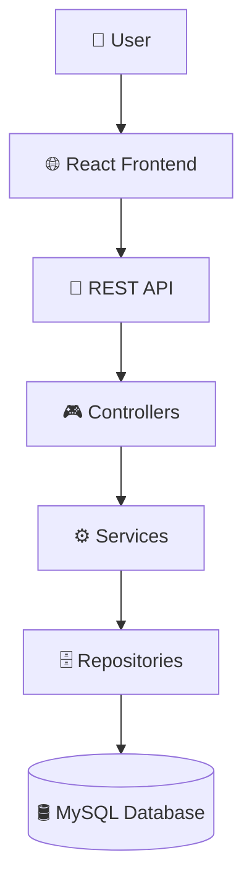
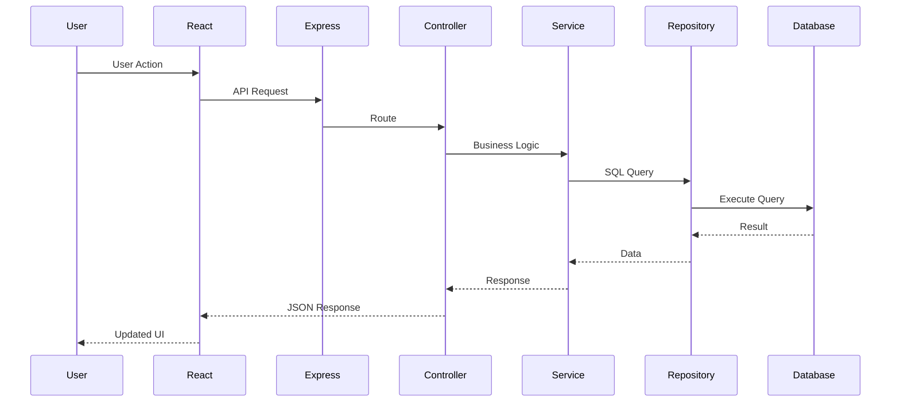
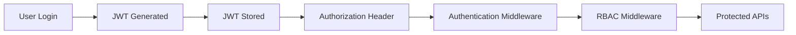

<div align="center">

# 🚀 AssetFlow

### Enterprise Asset Management System

<p align="center">
Manage • Track • Allocate • Maintain • Audit • Report
</p>

<p align="center">


</p>

---

### 📦 Smart Asset Management for Modern Organizations

A full-stack Enterprise Asset Management System that helps organizations efficiently manage assets throughout their complete lifecycle.

From procurement to allocation, transfers, maintenance, auditing, reporting and analytics — AssetFlow centralizes everything into one intelligent platform.

---

</div>

# 📖 Table of Contents

- [✨ Features](#-features)
- [🏗 System Architecture](#-system-architecture)
- [⚙ Tech Stack](#-tech-stack)
- [📁 Project Structure](#-project-structure)
- [👨‍💻 Team Responsibilities](#-team-responsibilities)
- [🔐 Authentication Flow](#-authentication-flow)
- [🔄 Backend Architecture](#-backend-architecture)
- [📊 Database Design](#-database-design)
- [🚀 Installation](#-installation)
- [▶ Running the Project](#-running-the-project)
- [🌐 API Overview](#-api-overview)
- [📸 Screenshots](#-screenshots)
- [🛣 Future Scope](#-future-scope)
- [🤝 Contribution](#-contribution)
- [📜 License](#-license)

---

# ✨ Features

## 🔐 Authentication & Security

- JWT Authentication
- Refresh Token Authentication
- Secure Password Hashing (bcrypt)
- Role-Based Access Control (RBAC)
- Protected API Routes
- Server-side Validation
- Parameterized SQL Queries
- Express Validator
- Centralized Error Handling

---

## 📦 Asset Management

- Register New Assets
- Update Asset Details
- Delete Assets
- Auto-generated Asset Tags
- Asset QR Codes
- Asset Categories
- Asset Search
- Asset Filters
- Asset History Timeline
- Asset Lifecycle Tracking

---

## 👤 Asset Allocation

- Allocate Assets to Employees
- Department-wise Allocation
- Asset Return Workflow
- Expected Return Tracking
- Condition Check-in Notes
- Active Allocation Detection
- Overdue Asset Detection

---

## 🔄 Asset Transfers

- Transfer Requests
- Approval Workflow
- Rejection Workflow
- Transfer History
- Department Transfers

---

## 📅 Booking System

- Book Shared Assets
- Booking Conflict Detection
- Upcoming Bookings
- Booking Status Tracking

---

## 🛠 Maintenance

- Raise Maintenance Requests
- Maintenance Approval
- Technician Assignment
- Maintenance History
- Asset Status Updates

---

## 📋 Audit Management

- Audit Cycles
- Auditor Assignment
- Discrepancy Reports
- Audit Logs

---

## 📊 Reports

- Inventory Report
- Allocation Report
- Transfer Report
- Maintenance Report
- Audit Report
- Organization Summary
- CSV Export

---

## 📈 Dashboard

- Total Assets
- Available Assets
- Allocated Assets
- Assets Under Maintenance
- Pending Transfers
- Upcoming Bookings
- Organization KPIs
- Quick Statistics

---


# 🏗 System Architecture

AssetFlow follows a modular layered architecture to ensure scalability, maintainability, and separation of concerns.



---

# 🔄 Backend Request Flow



---

# 🔐 Authentication Flow



---

# ⚙ Tech Stack

## 🎨 Frontend

| Technology | Purpose |
|------------|----------|
| React.js | Frontend Framework |
| Vite | Build Tool |
| Tailwind CSS | Styling |
| Context API | State Management |
| React Router | Routing |
| Axios | API Calls |

---

## 🖥 Backend

| Technology | Purpose |
|------------|----------|
| Node.js | Runtime |
| Express.js | REST APIs |
| JWT | Authentication |
| bcrypt | Password Hashing |
| Express Validator | Validation |
| MySQL2 | Database Driver |
| Multer | File Uploads |
| QRCode | QR Generation |
| JSON2CSV | CSV Reports |

---

## 🗄 Database

| Technology | Purpose |
|------------|----------|
| MySQL | Relational Database |

---

## 🔒 Security

- JWT Authentication
- Refresh Tokens
- Password Hashing
- Parameterized SQL Queries
- RBAC
- Express Validator
- Secure Error Handling

---


# 📁 Project Structure

```text
assetflow-erp_odoo/
│
├── 📂 client/
│   ├── src/
│   │   ├── api/
│   │   ├── assets/
│   │   ├── components/
│   │   ├── context/
│   │   ├── hooks/
│   │   ├── pages/
│   │   ├── routes/
│   │   ├── utils/
│   │   ├── App.jsx
│   │   └── main.jsx
│   │
│   ├── package.json
│   └── vite.config.js
│
├── 📂 server/
│   │
│   ├── src/
│   │   ├── config/
│   │   ├── middlewares/
│   │   ├── modules/
│   │   │
│   │   ├── auth/
│   │   ├── users/
│   │   ├── departments/
│   │   ├── categories/
│   │   ├── assets/
│   │   ├── allocations/
│   │   ├── transfers/
│   │   ├── bookings/
│   │   ├── maintenance/
│   │   ├── audits/
│   │   ├── notifications/
│   │   ├── activityLogs/
│   │   └── reports/
│   │
│   ├── utils/
│   ├── app.js
│   └── server.js
│
├── 📂 database/
│   ├── schema.sql
│   ├── seed.sql
│   └── migrations/
│
├── 📂 docs/
│
├── .env.example
├── README.md
└── .gitignore
```

---

# 👨‍💻 Team Responsibilities

| Developer | Responsibility |
|-----------|----------------|
| 👩 Developer 1 | Frontend Development |
| 👨 Developer 2 | Assets, Allocations, Transfers, Reports, Dashboard APIs |
| 👨 Developer 3 | Authentication, Users, Departments, Categories, Database, Middleware |
| 👨 Developer 4 | Bookings, Maintenance, Audits |

---

# 🏗 Backend Module Architecture

Every backend module follows the exact same architecture.

```text
routes.js
      │
      ▼
controller.js
      │
      ▼
service.js
      │
      ▼
repository.js
      │
      ▼
MySQL Database
```

---

## 📌 Responsibilities

### routes.js

- Express Router
- API Endpoints
- Middleware
- Route Definitions

---

### controller.js

- Parse Request
- Call Services
- Return Responses
- No Business Logic

---

### service.js

- Business Logic
- Transactions
- Validation
- Calls Repository

---

### repository.js

- SQL Queries
- Database Access
- Parameterized Queries Only

---

### validators.js

- Request Validation
- express-validator Rules
- Input Sanitization

---

# 🗃 Main Modules

| Module | Description |
|---------|-------------|
| 🔐 Auth | Authentication & JWT |
| 👥 Users | Employee Management |
| 🏢 Departments | Department Management |
| 🏷 Categories | Asset Categories |
| 📦 Assets | Asset CRUD |
| 👤 Allocations | Asset Assignment |
| 🔄 Transfers | Asset Transfer Workflow |
| 📅 Bookings | Shared Asset Booking |
| 🛠 Maintenance | Maintenance Workflow |
| 📋 Audits | Audit Cycles |
| 🔔 Notifications | User Notifications |
| 📊 Reports | CSV & Analytics |

---

